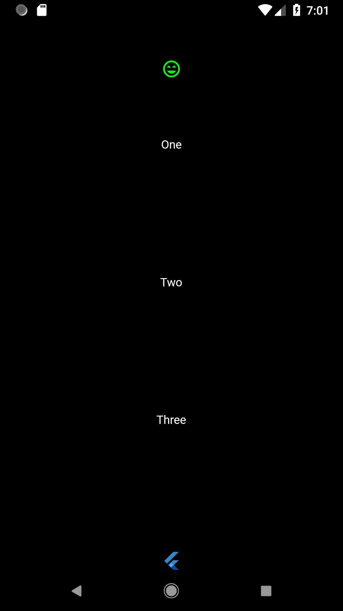

# Column

[Column](https://docs.flutter.io/flutter/widgets/Column-class.html) widget demo app

## Getting Started

For help getting started with Flutter, view online
[documentation](https://flutter.io/).
