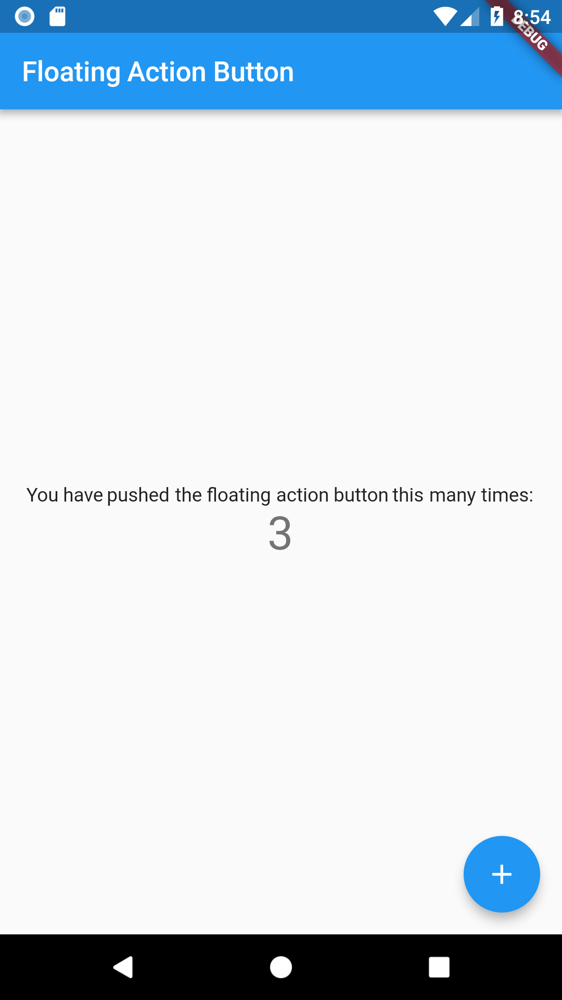

# FloatingActionButton

[FloatingActionButton](https://docs.flutter.io/flutter/material/FloatingActionButton-class.html) widget demo app

 

## Getting Started

For help getting started with Flutter, view online
[documentation](https://flutter.io/).
