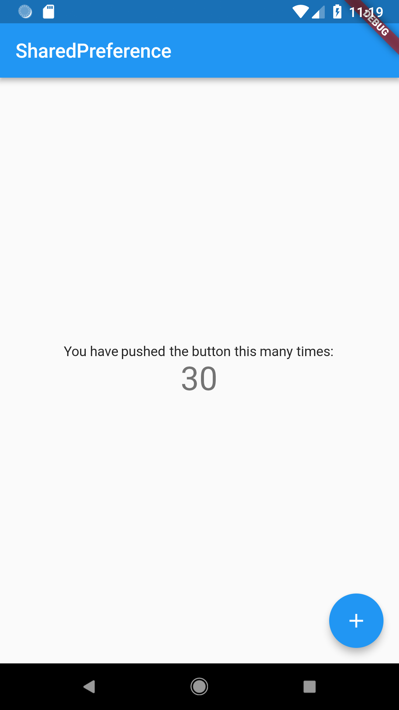

# shared_preference

Demo app using the [SharedPreferences plugin](https:&#x2F;&#x2F;pub.dartlang.org&#x2F;packages&#x2F;shared_preferences), providing a to persistent store for simple data 

 

## Getting Started

For help getting started with Flutter, view our online
[documentation](https://flutter.io/).
